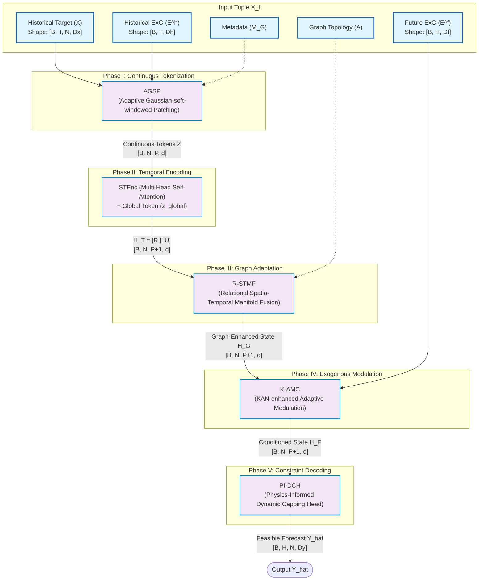
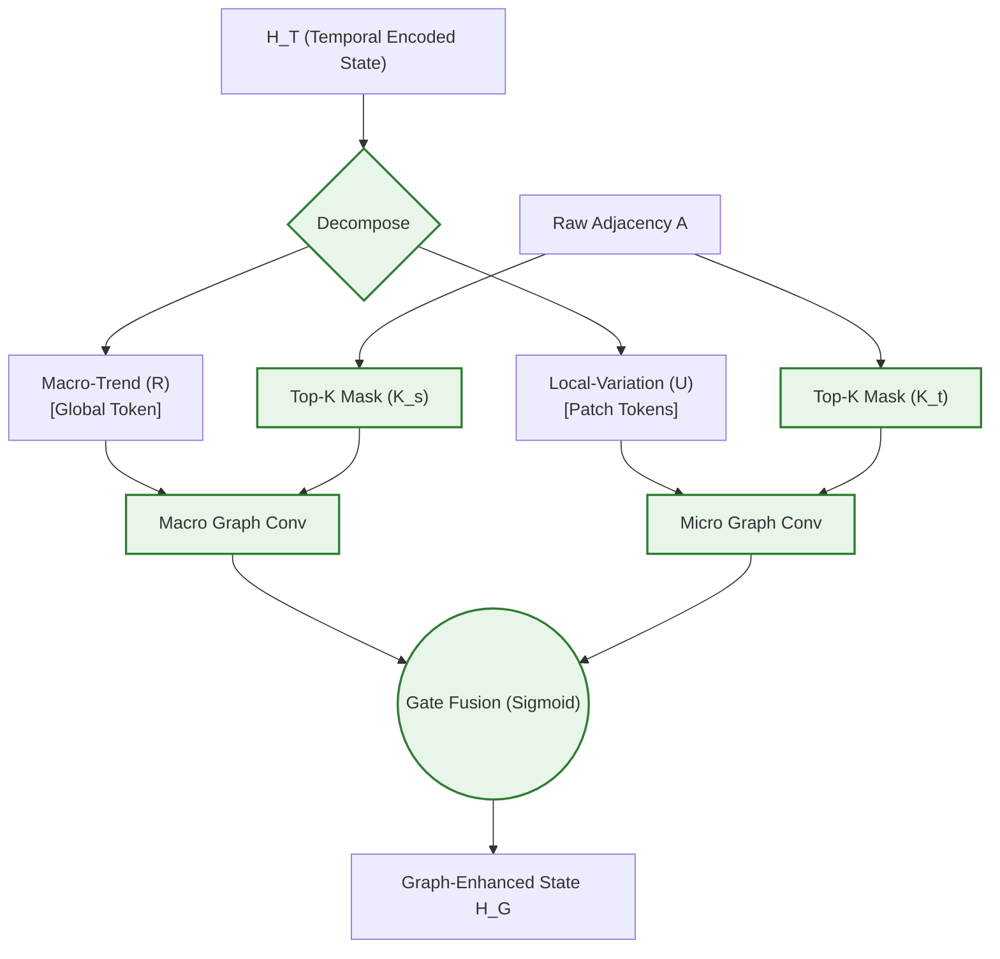
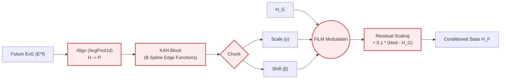
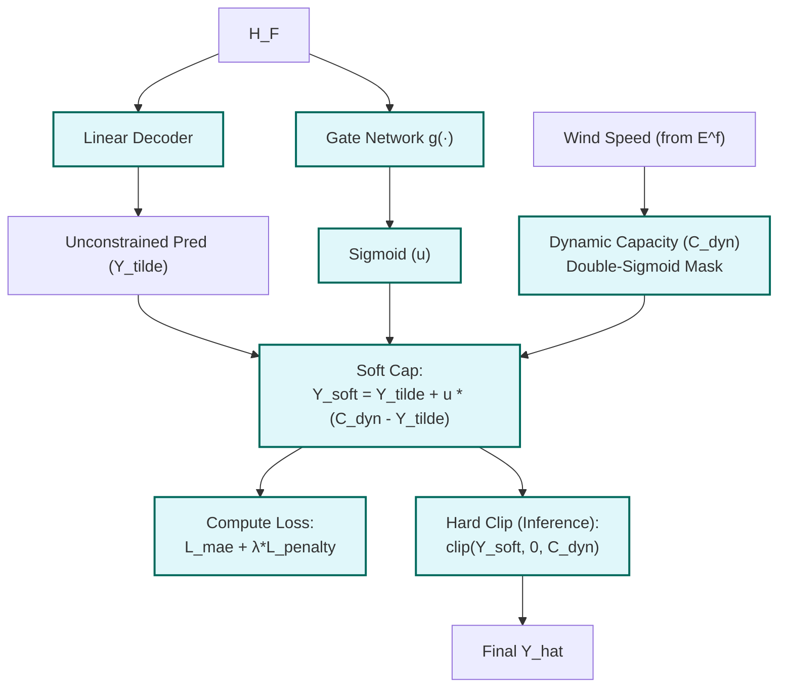

# PhyST-Net 架构设计与公式速查表 (Architecture Cheat Sheet)

## 1. PhyST-Net 整体架构与数据流 (Overall Architecture)

整体架构遵循 `Encoder-Decoder` 范式，但物理约束贯穿始终。

## 2. 局部核心模块拆解与公式

### (1) AGSP (自适应高斯软窗口 Patching)
解决传统 Hard Patching 带来的物理事件边界割裂（边界伪影）问题。

*   **核心公式**：
    $$W_i(\tau)=\exp\left(-\frac{(\tau-\mu_i)^2}{2\sigma_i^2+\epsilon}\right)$$
*   **数据流**：$[B, N, T, D] \xrightarrow{\text{Soft Windowing}} [B, N, P, D_{model}]$

### (2) R-STMF (关系型时空流形融合)
解耦宏观气象趋势与局部物理拓扑，避免图卷积的信息混淆。

*   **核心公式** (Top-K 稀疏掩码)：
    $$A_c=\operatorname{Softmax}\left(\operatorname{Mask}(S_c, K_c)\right)$$
*   **物理意义**：强制网络只能在其真实的物理“局部邻居”内传递高频扰动信号，极大降低复杂度 $O(P \cdot K \cdot N)$。

### (3) K-AMC (基于 KAN 的外生变量调制)
将客观可知的未来 NWP 数据，以极高表达力注入模型。

*   **核心公式** (KAN 样条函数与残差 FiLM)：
    $$\phi(x) = w_b \operatorname{SiLU}(x) + \sum_{i=1}^{k} c_i B_i(x)$$
    $$H_F=H_G+\lambda\left(\gamma\odot H_G+\beta-H_G\right)$$

### (4) PI-DCH (物理信息动态封顶头)
构建安全边界，解决由于强制 Hard Clip 带来的反向传播梯度断裂问题。

*   **核心公式** (软逼近与可微罚项)：
    $$\hat{Y}_{soft}=\tilde{Y}+u\odot(C_{dyn}-\tilde{Y})$$
    $$\mathcal{L}_{cap} = \frac{1}{|\mathcal{D}|HN} \sum [\hat{Y}_{soft} - C_{dyn}]^+$$
*   **数据流最终收束**：预测输出维度为 $[B, H, N, D_y]$，且严格遵守物理域知识 $\Omega$ 定义的上下界。